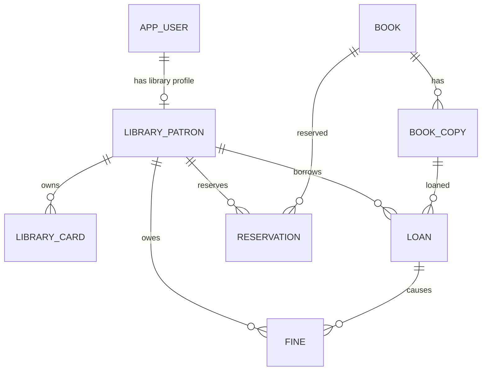

# v5 Library Data Model

## Ownership

### Existing platform-owned

Library không sở hữu schema/identity của:

- `app_user`
- `role`
- `user_role`
- `student`
- `teacher`
- notification/mail core
- Spring Batch metadata tables

Library chỉ reference khi cần.

### Library-owned

Baseline:

```text
book
book_copy
library_patron
library_card
loan
reservation
fine
library_batch_run_summary   # optional if existing Batch metadata/API not enough
library_policy              # optional / AI policy Q&A or centralized rules
```

## Relations



## Core constraints

- `library_patron.user_id` unique FK → `app_user.user_id`.
- `library_card.card_no` unique.
- one ACTIVE card per patron; implementation constraint/lifecycle must be transaction-safe.
- `book_copy.barcode` unique.
- active loan uniqueness for copy protected at DB/transaction level.
- overdue fine unique per loan/type.
- fine amount non-negative and capped by fine-type policy where applicable.
- history rows không cascade-delete khi book/patron lifecycle changes.

## MySQL types

Guideline:

- IDs: match existing BIGINT strategy.
- money: `DECIMAL(12,2)` or compatible repo convention.
- enums: prefer VARCHAR + Java enum/check strategy consistent với project; do not rely on PostgreSQL enum.
- tags: JSON or normalized table, not array.
- timestamps: match repo time convention for new domain and document choice in Developer Plan.

## Migration

Không copy `V1__...V7__...` từ training spec.

Implementation phải:

1. read current migration head on target branch;
2. allocate next migration(s);
3. add `LIBRARIAN` role idempotently/compatibly;
4. create Library tables;
5. add constraints/indexes;
6. add seed only if demo policy allows.

Production migration không dùng `ddl-auto=update`; existing `validate` posture được giữ.
