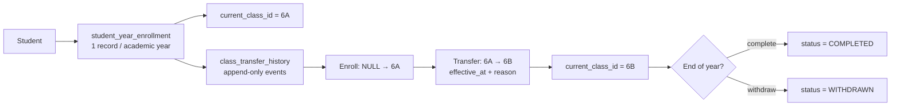

# Developer Plan 026: Student Enrollment & Class Placement

## 1. Trạng thái và phiên bản áp dụng

- Status: `Approved by user on 2026-08-21`.
- Application-document version: `v2`.
- Phụ thuộc: migration/authorization foundation của Plan 025 đã có trong repository; Plan 026 không đổi contract legacy `/api/v1/students/**`.
- User decisions đã chốt: code phải comment traceability `FR`/`BR` cần thiết; API mới dùng namespace `/api/v2`; `WITHDRAWN` được bổ sung; `capacity` không là hard limit; metadata academic bao gồm close/delete; lifecycle academic ưu tiên requirement (`DRAFT/ACTIVE/CLOSED`, `PLANNED/ACTIVE/CLOSED`).

## 2. Mục tiêu

Triển khai backend cho giáo vụ để tạo dữ liệu lớp tối thiểu cần thiết, xếp một hoặc nhiều học sinh vào lớp, chuyển lớp có lịch sử bất biến, và truy vấn học sinh chưa được xếp/lịch sử lớp theo từng năm học.

Mục tiêu truy vết: `FR-CLASS-001`–`FR-CLASS-004`, `FR-ENROLL-001`–`FR-ENROLL-005`; `BR-CLASS-002`–`BR-CLASS-011`, `BR-ENROLL-001`–`BR-ENROLL-008`, `BR-COMMON-001`–`BR-COMMON-004` và `BR-AUTH-005`–`BR-AUTH-006`.

## 3. Phạm vi

### In-scope

- Academic foundation tối thiểu cho enrollment: `grade_level`, `academic_year` và `school_class` cùng CRUD/list giới hạn cho giáo vụ.
- Enrollment trong một năm học: xếp đơn lẻ, xếp hàng loạt atomic, danh sách học sinh chưa xếp, danh sách học sinh lớp và lịch sử lớp của học sinh.
- Chuyển lớp trong cùng năm học bằng transaction: cập nhật lớp hiện tại, thêm `class_transfer_history`, giữ lịch sử và lưu lý do/ngày hiệu lực.
- Ràng buộc database/JPA/API/test cho uniqueness, FK, trạng thái, authorization và cảnh báo mất cân bằng sĩ số; `capacity` chỉ là thông tin tham khảo, không chặn xếp lớp.
- Chỉ các role `ADMIN` và `ACADEMIC_OFFICE` được mutation; `TEACHER` chỉ được xem danh sách/lịch sử trong Plan này. `STUDENT` không có API enrollment trong scope này.

### Out-of-scope

- Học kỳ, môn học, giáo viên, phân công, điểm danh, điểm số, transcript và calculation worker.
- `FR-ENROLL-006`–`FR-ENROLL-008`: kết chuyển năm học, import phân lớp, lên lớp/lưu ban/thôi học/hoàn thành THCS.
- Frontend, Postman collection, production migration/cutover, thay đổi hoặc xóa endpoint/response shape của API legacy `/api/v1/**`.
- Xóa cứng enrollment/lịch sử hoặc tự tạo quy tắc phân lớp tối ưu.

## 4. Thiết kế dữ liệu và migration

1. Thêm Flyway migration tiếp theo V3 theo thứ tự: `grade_level`, `academic_year`, `school_class`, `student_year_enrollment`, `class_transfer_history`; enum enrollment có `WITHDRAWN`.
2. Dùng `BIGINT`/Java `Long` nhất quán với schema Flyway hiện có; thêm FK và index tra cứu theo năm học/lớp/trạng thái.
3. Áp dụng unique `(student_id, academic_year_id)` cho `student_year_enrollment`, bảo đảm một hồ sơ enrollment/năm học; `current_class_id` là lớp hiện tại.
4. Khi tạo enrollment, thêm một history record khởi tạo với `from_class_id = NULL`, `to_class_id = current_class_id`. Khi chuyển lớp, không cập nhật history cũ.
5. Không dùng cascade delete cho enrollment/history. Lớp hoặc năm học đã có enrollment không thể xóa; lớp đóng chỉ xem được và không nhận enrollment mới.
6. Cập nhật application documentation v2 chỉ khi cần phản ánh quyết định đã được phê duyệt; không sửa requirement code.

## 5. API contract v2 đề xuất

Tất cả success/error response tiếp tục đi qua `RestResponse`. API Plan 026 dùng `/api/v2/**` để có thể song song với API `/api/v1/**` cùng chức năng nếu cần; không redirect, thay thế hoặc đổi contract v1. DTO request/response riêng, không đưa entity ra HTTP.

| Method | Path | Quyền | Mục đích |
|---|---|---|---|
| `GET`/`POST`/`PUT` | `/api/v2/academic-years` | ADMIN, ACADEMIC_OFFICE | List/tạo/sửa năm học chưa đóng |
| `POST`/`DELETE` | `/api/v2/academic-years/{academicYearId}/close`, `/api/v2/academic-years/{academicYearId}` | ADMIN, ACADEMIC_OFFICE | Đóng năm học; chỉ xóa năm học chưa phát sinh dữ liệu |
| `GET`/`POST`/`PUT` | `/api/v2/grades` | ADMIN, ACADEMIC_OFFICE | List/tạo/sửa metadata khối |
| `GET`/`POST`/`PUT` | `/api/v2/classes` | ADMIN, ACADEMIC_OFFICE | List/tạo/sửa lớp; `TEACHER` chỉ GET |
| `POST`/`DELETE` | `/api/v2/classes/{classId}/close`, `/api/v2/classes/{classId}` | ADMIN, ACADEMIC_OFFICE | Đóng lớp; chỉ xóa lớp chưa phát sinh dữ liệu |
| `GET` | `/api/v2/classes/{classId}/students` | ADMIN, ACADEMIC_OFFICE, TEACHER | Danh sách học sinh active của lớp |
| `POST` | `/api/v2/enrollments` | ADMIN, ACADEMIC_OFFICE | Xếp một học sinh vào lớp |
| `POST` | `/api/v2/enrollments/bulk` | ADMIN, ACADEMIC_OFFICE | Xếp nhiều học sinh atomic vào một lớp |
| `POST` | `/api/v2/enrollments/{enrollmentId}/transfer` | ADMIN, ACADEMIC_OFFICE | Chuyển lớp trong cùng năm học |
| `GET` | `/api/v2/enrollments/unassigned` | ADMIN, ACADEMIC_OFFICE, TEACHER | Học sinh chưa có enrollment của năm học |
| `GET` | `/api/v2/students/{studentId}/enrollments` | ADMIN, ACADEMIC_OFFICE, TEACHER | Lịch sử lớp theo student |

`POST /enrollments` trả `201 Created`; bulk/transfer trả `200 OK` với kết quả và cảnh báo sĩ số. Mọi ID phải `> 0`; body bắt buộc kiểm tra existence, cùng academic year và trạng thái cho phép trước khi ghi.

## 6. Quy tắc nghiệp vụ và transaction

1. Enrollment chỉ hợp lệ khi student còn active, academic year active và school class active thuộc đúng academic year.
2. Mỗi student có tối đa một enrollment active trong một academic year. Request lặp hoặc enrollment khác lớp phải trả conflict, không tự chuyển lớp.
3. Bulk enrollment validate toàn bộ input (ID trùng, học sinh đã xếp, lớp/năm học/status) trước khi ghi; một lỗi làm rollback cả request.
4. Transfer chỉ thực hiện với enrollment `ACTIVE`, lớp đích khác lớp hiện tại, cùng academic year và active. Trong một transaction: cập nhật `current_class_id`, thêm một history record mới (record cũ giữ nguyên), ghi audit metadata và tính cảnh báo cho cả lớp nguồn/đích.
5. Mọi đọc danh sách lớp/học sinh chỉ coi enrollment `ACTIVE` là sĩ số hiện tại. Cảnh báo lệch dưới `0.8×` hoặc trên `1.2×` trung bình khối là warning trả về, không chặn thao tác.
6. Không xóa enrollment đã phát sinh attendance/score. Vì hai module đó ngoài scope, Plan này chỉ thiết kế service guard/repository extension point và không tự suy đoán bảng chưa tồn tại.

## 6.1. Comment traceability bắt buộc khi coding

- Mỗi controller/service/entity/migration mới phải có comment ngắn ở class/method/constraint nêu mã `FR-*` hoặc `BR-*` trực tiếp chi phối nó; ví dụ `// BR-ENROLL-001: một student chỉ có một enrollment active mỗi năm học.`
- Với transaction transfer, comment rõ `BR-ENROLL-002`–`BR-ENROLL-005`, `BR-ENROLL-008`, `NFR-RELIABILITY-005` và `NFR-AUDITABILITY-001` tại service/migration/audit write tương ứng.
- Với class lifecycle, capacity warning và delete guards, comment `BR-CLASS-002`–`BR-CLASS-011` đúng nhánh nghiệp vụ. Không chép nguyên baseline dài dòng hoặc gắn mã requirement không liên quan.
- Test method đặt tên theo behavior và đặt comment traceability tại nhóm test khi tên không thể hiện đầy đủ rule.

### 6.2. Làm rõ `effectiveAt` sau khi người dùng chọn hướng 1

Đã chốt: `effectiveAt` là thời điểm **hiệu lực nghiệp vụ** của sự kiện chuyển lớp,
không phải thời điểm hệ thống nhận request (`createdAt`) và không phải thời điểm
cập nhật hồ sơ enrollment (`updatedAt`). Vì Plan 026 cập nhật `current_class_id`
ngay trong transaction transfer, `effectiveAt` phải thỏa các điều kiện sau:

1. Không được lớn hơn thời điểm xử lý request theo múi giờ nghiệp vụ `Asia/Ho_Chi_Minh`;
2. Không được nhỏ hơn `effectiveAt` gần nhất của history cùng enrollment;
3. Được lưu trong `class_transfer_history` và dùng để sắp xếp timeline chuyển lớp;
4. Transfer không phải là thao tác lên hồ sơ `Student`; `Student.java` không thêm field
   `effectiveAt`.

`createdAt` tiếp tục phản ánh thời điểm ghi history. Cho phép backdate trong quá khứ
nhưng không cho phép tạo sự kiện làm timeline lùi ngược. Cơ chế chuyển lớp có hiệu lực
trong tương lai/scheduled transfer không thuộc Plan 026.

## 7. Decision gates cần user xác nhận trước implementation

| Gate | Cần chốt | Đề xuất trong Plan 026 |
|---|---|---|
| E1 | `WITHDRAWN` có thuộc enrollment status không | **Đã chốt: Có.** Thêm `WITHDRAWN`; thao tác thôi học vẫn ngoài scope Plan 026. |
| E2 | Model history và `student_year_enrollment.status` khi transfer | **Đã chốt: phương án khuyến nghị.** Chuyển lớp nội bộ giữ enrollment `ACTIVE`, cập nhật `current_class_id` và append history; kết năm là `COMPLETED`, thôi học là `WITHDRAWN`. Không dùng `TRANSFERRED` cho chuyển lớp nội bộ. |
| E3 | `capacity` có hard limit không | **Đã chốt: Không.** Chỉ warning cân bằng sĩ số; không từ chối enrollment theo capacity. |
| E4 | Cách lưu audit đầy đủ old/new value | **Đã chốt: Phương án B.** Tạo `audit_log`; ghi before/after, actor, request ID và IP trong cùng transaction transfer. |
| E5 | API metadata academic có cần bao phủ delete/close ngay không | **Đã chốt: Có.** Bao gồm close và guarded delete như API contract v2. |
| E6 | Enum lifecycle academic bị lệch giữa requirement và data model | **Đã chốt: Đồng ý ưu tiên requirement.** Cập nhật data model/migration cùng implementation. |

Plan 026 được người dùng phê duyệt ngày 2026-08-21. Nếu các quyết định đã chốt bị thay đổi, cập nhật plan trước khi sửa code.

## 8. Phân tích để chốt E2 và E4

### 8.1. E2 — enrollment lifecycle và lịch sử chuyển lớp

`student_year_enrollment` là hồ sơ **của cả năm học**, còn `class_transfer_history` là nhật ký **các lần đổi lớp**. Hai bảng không nên cùng biểu diễn một lần chuyển lớp theo hai trạng thái mâu thuẫn.



**Đã chốt:** class transfer nội bộ giữ enrollment `ACTIVE` và chỉ append history; kết năm chuyển `COMPLETED`; thôi học chuyển `WITHDRAWN`. Không dùng `TRANSFERRED` cho chuyển lớp nội bộ vì record vẫn cần active ở lớp đích. Vì feature chưa tồn tại, cập nhật enum data model từ `ACTIVE/COMPLETED/TRANSFERRED` thành `ACTIVE/COMPLETED/WITHDRAWN` là an toàn hơn một giá trị đa nghĩa. Nếu cần “chuyển trường” sau này, xác định bằng CR riêng (ví dụ `TRANSFERRED_OUT`) thay vì tái sử dụng transfer lớp.

### 8.2. E4 — audit transfer

Baseline bắt buộc `NFR-AUDITABILITY-001` cho chuyển lớp; chỉ có `created_by/updated_by` không ghi được lớp cũ, lớp mới, lý do hay request context nên **không đủ**. `audit_log` đã có schema đích: actor, action, entity type/id, JSON before/after, request ID, IP và thời điểm.

| Phương án | Đáp ứng audit transfer | Hệ quả |
|---|---|---|
| A. Chỉ audit metadata | Không | Thiếu old/new values; không đạt NFR bắt buộc. |
| B. Tạo `audit_log` trong Plan 026 | Có | Migration thêm bảng/index; ghi audit trong đúng transaction transfer. **Khuyến nghị.** |
| C. Hoãn transfer đến plan audit | Có, nhưng chặn FR-ENROLL-003 | Không phù hợp mục tiêu Plan 026. |

**Đã chốt phương án B:** ghi một event `STUDENT_ENROLLMENT_TRANSFER` với `entity_type=student_year_enrollment`, `entity_id=enrollmentId`, `before_data` chứa lớp/status trước chuyển và `after_data` chứa lớp/status sau chuyển cùng transfer history ID. `actor_user_id` lấy từ principal, `request_id` từ filter hiện có, IP từ HTTP request; audit insert và transfer transaction phải cùng commit/rollback.

## 9. Files dự kiến sau approval

### Tạo mới

- Flyway migration `V4__create_academic_structure_enrollment_and_audit.sql` (tên version xác nhận lại theo migration thực tế trước khi tạo).
- Packages `academic/` và `enrollment/`: entity, enum, repository, DTO request/response, service và controller.
- Unit test service và integration test MockMvc/H2 cho academic/enrollment.
- `document/dev-note/be/enrollment/026-student-enrollment-class-placement-2026-08-21.md` sau implementation.

### Cập nhật

- `document/application-doc/.../data-model/02-AcademicCatalog.md`, `03-StudentsAndEnrollment.md` và `08-AuditAndConstraints.md` theo các decision đã chốt, gồm audit event transfer.
- `document/dev-impl-plan/be/BE_DEV_PLAN_SUMMARY.md` và `document/dev-impl-plan/summary/DEV_PLAN_SUMMARY.md`.
- Security/configuration chỉ khi cần bổ sung mapping quyền đã được chốt; các Student API legacy không thay đổi.

## 10. Kế hoạch kiểm thử và validation

| Nhóm | Case chính |
|---|---|
| Migration | Schema trống có đủ bảng/FK/index/unique; Flyway chạy sau V3; JPA `validate` khởi động được. |
| Academic | Không tạo lớp sai academic year/grade, tên/mã class unique đúng scope, không sửa grade của lớp có enrollment. |
| Enroll | Create thành công; duplicate student-year conflict; student/lớp/năm học không tồn tại hoặc inactive bị từ chối; bulk rollback toàn bộ khi một item sai. |
| Transfer/audit | Lớp đích khác và cùng năm học thành công; history bất biến; transaction rollback khi insert history hoặc audit thất bại; audit before/after/actor/request ID đúng; lớp cũ/mới trả warning balance đúng ngưỡng. |
| Transfer/effectiveAt | Từ chối `effectiveAt` ở tương lai; từ chối `effectiveAt` nhỏ hơn history gần nhất; chấp nhận thời điểm hiện tại/quá khứ hợp lệ và giữ thứ tự timeline. |
| Authorization | Anonymous `401`; STUDENT `403`; TEACHER không mutation; ADMIN/ACADEMIC_OFFICE có mutation. |
| Regression | Auth, Student CRUD/CSV và Flyway tests hiện có vẫn pass; contract `/api/v1/students/**` không đổi. |

Sau implementation chạy từ `BE/BaiTap-RS`:

```bash
./gradlew test
./gradlew jacocoTestReport
./gradlew checkstyleMain checkstyleTest
./gradlew pmdMain pmdTest
./gradlew build
```

Đọc JaCoCo, Checkstyle và PMD report; sửa lỗi bắt buộc trước khi báo cáo theo workflow backend.

## 11. Rủi ro và giảm thiểu

| Rủi ro | Giảm thiểu |
|---|---|
| Mâu thuẫn giữa requirement và data model về `WITHDRAWN`/transfer status | E1 đã chốt; chặn implementation tại E2, ghi decision lifecycle vào data model trước migration. |
| Lớp/năm học chưa tồn tại trong hệ thống hiện tại | Bao gồm academic foundation tối thiểu, không giả định seed data. |
| Race condition xếp cùng student hai lần | Unique DB constraint, transaction và conflict mapping; thêm test cạnh tranh nếu repository/database test hỗ trợ deterministic. |
| Transfer làm mất lịch sử | Append-only history và integration assertion cho cả record cũ/mới. |
| Scope lan sang promotion/withdrawal | Giữ E1 và out-of-scope rõ ràng; yêu cầu plan/CR kế tiếp. |

## 12. Output và approval

Sau approval, output là API backend và migration có test cho Student Enrollment & Class Placement, Dev Note ghi bằng chứng validation và các decision còn mở. Không có code, schema hay frontend nào được thay đổi trong bước lập plan này.
