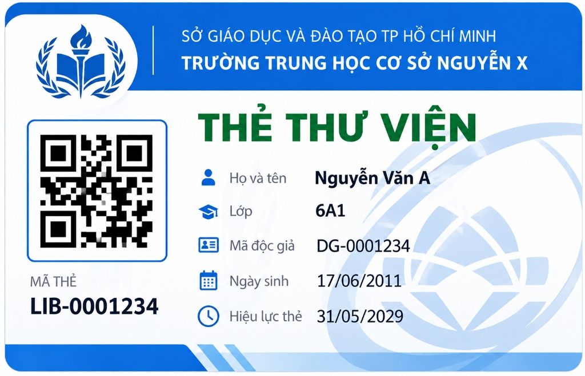

# Plan 097 — Quản lý bạn đọc và cấp phát / thu hồi thẻ thư viện

Tài liệu này lưu trữ đặc tả thiết kế wireframe tương tác và quy cách giao diện cho [Kế hoạch 097](../../../dev-impl-plan/summary/097-library-patron-and-card-2026-10-08.md) thuộc hệ thống Academic Core (phân hệ Thư viện v5).

Wireframe được xây dựng hoàn toàn bằng HTML5, CSS3 và JavaScript thuần độc lập (self-contained), không phụ thuộc mạng hay thư viện ngoài, chạy trực tiếp khi mở tệp [`index.html`](index.html) bằng bất kỳ trình duyệt web hiện đại nào.

---

## 1. Trạng thái và phạm vi chức năng wireframe

### 1.1. Mục tiêu giao diện
Cung cấp đầy đủ các màn hình và hộp thoại tương tác để:
1. **Dành cho Thủ thư (`LIBRARIAN`) & Quản trị viên (`ADMIN`):**
   - Xem danh sách bạn đọc học sinh và giáo viên cùng trạng thái thẻ thư viện.
   - Tìm kiếm, lọc theo đối tượng (Học sinh/Giáo viên), khối/lớp, trạng thái bạn đọc (`ACTIVE`, `BORROWING_SUSPENDED`, `CLOSED`) và trạng thái thẻ (`ACTIVE`, `EXPIRED`, `REVOKED`, Chưa cấp thẻ).
   - Kích hoạt hồ sơ bạn đọc mới từ tài khoản trường học `app_user` hiện hữu.
   - Phát hành thẻ mới với ràng buộc duy nhất: mỗi bạn đọc chỉ có tối đa 01 thẻ mang trạng thái `ACTIVE` tại cùng một thời điểm.
   - Thu hồi thẻ kèm lý do bắt buộc (Mất thẻ, Thẻ hỏng, Chuyển trường, Vi phạm quy chế...) và ghi chú chi tiết.
   - Cấp lại thẻ (Reissue): Thu hồi an toàn thẻ cũ và phát hành thẻ mới với mã thẻ & chữ ký số mới.
   - Tạm đình chỉ hoặc gỡ đình chỉ quyền mượn sách độc lập với tài khoản đăng nhập học vụ.
   - Xem chi tiết hồ sơ bạn đọc, thẻ điện tử CR-80 và bảng lịch sử toàn bộ các thẻ đã từng cấp.
   - Xem mã QR phân giải cao và chi tiết payload ký HMAC-SHA256: `v1|{cardNo}|{patronId}|{expEpochDay}|{signature}`.
   - Giả lập công cụ quét và xác thực mã QR 6 bước theo đặc tả `POST /api/v2/library-cards/verify`.
   - In thẻ thư viện: In thẻ cá nhân chuẩn CR-80 hoặc in thẻ hàng loạt trên lưới giấy A4 (8 thẻ/trang) với CSS `@media print` chuyên dụng.
2. **Dành cho Bạn đọc (`STUDENT` / `TEACHER`):**
   - Xem trực quan thẻ thư viện số của bản thân (`LibraryMyCardView`).
   - Kiểm tra điều kiện mượn sách cá nhân và hạn dùng thẻ.
   - Tính năng báo mất thẻ kịp thời cho thư viện.
3. **Đối chiếu mẫu thẻ gốc:**
   - So sánh song song giữa bản dựng HTML5/CSS3 và ảnh mẫu gốc [`sample-library-card.jpg`](sample-library-card.jpg).

---

## 2. Hướng dẫn xem trước và trải nghiệm tương tác

Mở trực tiếp tệp [`index.html`](index.html) bằng trình duyệt web:

### 2.1. Thanh điều khiển xem trước (Demo Rail)
Nằm ở trên cùng trang (ngoài shell sản phẩm), hỗ trợ kiểm thử các kịch bản:
- **Chế độ xem màn hình:**
  - `Quản lý thẻ & bạn đọc`: Giao diện làm việc chính của Thủ thư/Admin.
  - `Thẻ thư viện của tôi`: Giao diện cá nhân của học sinh/giáo viên.
  - `Đối chiếu mẫu gốc (CR-80)`: So sánh đối chiếu với ảnh mẫu gốc `sample-library-card.jpg`.
- **Vai trò xem trước (Role Switcher):**
  - `Thủ thư (LIBRARIAN)`: Toàn quyền quản lý, phát hành, thu hồi, đình chỉ.
  - `Quản trị viên (ADMIN)`: Đầy đủ quyền quản trị thư viện.
  - `Bạn đọc đã đăng nhập (STUDENT / TEACHER)`: Tự động chuyển về màn hình "Thẻ thư viện của tôi", ẩn các tính năng quản lý của người khác.
- **Trạng thái màn hình (State Switcher):**
  - `Bình thường (Normal)`: Dữ liệu bảng hiển thị đầy đủ, hoạt động tương tác bình thường.
  - `Đang tải (Loading)`: Hiển thị khối trạng thái đang tải dữ liệu từ máy chủ.
  - `Không có kết quả (Empty)`: Hiển thị trạng thái danh sách trống kèm nút "Đặt lại bộ lọc".
  - `Lỗi kết nối (Error 500)`: Hiển thị thông báo lỗi kèm nút "Thử lại".
  - `Không có quyền (Forbidden 403)`: Mô phỏng người dùng không có quyền truy cập.
  - `Xung đột phiên bản (Conflict 409)`: Mô phỏng lỗi optimistic lock khi dữ liệu bị sửa đổi bởi người khác trước khi lưu.

### 2.2. Các thao tác tương tác có thể thử nghiệm
1. **Phát hành thẻ mới:** Bấm nút `Phát hành thẻ mới` trên đầu trang hoặc bấm `Cấp thẻ` ở dòng bạn đọc chưa có thẻ. Chọn chính sách thời hạn (12 tháng, hết năm học, 24 tháng hoặc tùy chọn). Thử cấp thẻ cho bạn đọc đã có thẻ `ACTIVE` để thấy cảnh báo chặn `CARD_ALREADY_ACTIVE`.
2. **Thu hồi thẻ:** Bấm nút `Thu hồi` trên dòng bạn đọc có thẻ. Chọn lý do thu hồi (Mất thẻ, Hư hỏng, Chuyển trường...) và nhập ghi chú. Thẻ sẽ chuyển ngay sang trạng thái `REVOKED` và hiển thị dấu ấn màu đỏ rõ ràng.
3. **Cấp lại thẻ:** Bấm `Cấp lại` để thu hồi thẻ cũ và sinh mã thẻ mới trong một thao tác.
4. **Đình chỉ quyền mượn sách:** Bấm biểu tượng `⏸` để đình chỉ quyền mượn của bạn đọc vi phạm. Ghi nhận thông báo: việc đình chỉ này không ảnh hưởng tài khoản đăng nhập của học sinh.
5. **Xem chi tiết & Lịch sử thẻ:** Bấm `Xem` trên dòng bạn đọc để mở trang chi tiết, xem thẻ CR-80 trực quan và toàn bộ lịch sử các thẻ từng cấp.
6. **Giả lập xác thực QR:** Bấm `Giả lập xác thực QR` trên thanh công cụ. Có sẵn các nút mẫu: Thẻ hợp lệ, Thẻ đã thu hồi, Bạn đọc bị đình chỉ, Dữ liệu bị sửa đổi (tampered) để quan sát quy trình kiểm tra 6 bước.
7. **In thẻ thư viện:** Chọn các checkbox trong bảng rồi bấm `In thẻ các mục đã chọn`, hoặc bấm `In thẻ này` trong trang chi tiết để xem trước phôi thẻ và thử nghiệm in thực tế qua lệnh in trình duyệt (`Ctrl + P`).

---

## 3. Quy cách thiết kế thẻ CR-80 (Card Template Specifications)

Mẫu thẻ gốc được người dùng cung cấp và lưu trữ tại:
- **Tệp ảnh mẫu gốc:** [`sample-library-card.jpg`](sample-library-card.jpg)
- **Tệp lưu trữ phân hệ v5:** [`document/application-doc/v5/assets/sample-library-card.jpg`](../../../application-doc/v5/assets/sample-library-card.jpg)



### 3.1. Kích thước và tỷ lệ chuẩn
- **Tiêu chuẩn kích thước:** Thẻ nhựa ID-1 / CR-80 tiêu chuẩn quốc tế (ISO/IEC 7810).
  - Chiều rộng: `85.60 mm` (~1011 px ở 300 DPI, hoặc 520 px ở hiển thị màn hình web tiêu chuẩn).
  - Chiều cao: `53.98 mm` (~638 px ở 300 DPI, hoặc 328 px ở hiển thị màn hình web).
  - Tỷ lệ khung hình: `1.586 : 1`.
  - Bo góc (Corner Radius): `3.18 mm` (tương đương `16 px` trên giao diện web).
- **Chất liệu giả lập:** Thẻ nhựa PVC bóng mờ, viền bo tròn sắc nét.

### 3.2. Dải tiêu đề trên (Header Banner)
- **Màu nền:** Xanh dương đậm nhận diện giáo dục (`#1a56db` đến `#1e40af`).
- **Logo biểu trưng (Trái):**
  - Huy hiệu tròn viền xanh/trắng, trung tâm có ngọn đuốc tri thức, trang sách mở và hai nhánh nguyệt quế đối xứng.
- **Văn bản cơ quan & đơn vị trường (Trắng, chữ không chân sans-serif):**
  - Dòng 1: `SỞ GIÁO DỤC VÀ ĐÀO TẠO TP HỒ CHÍ MINH` (cỡ chữ 11px, đậm vừa, in hoa).
  - Dòng 2: `TRƯỜNG TRUNG HỌC CƠ SỞ NGUYỄN X` (in hoa, đậm nổi bật, cỡ chữ 14.5px).

### 3.3. Tiêu đề loại thẻ (Card Title)
- **Văn bản:** `THẺ THƯ VIỆN`
- **Màu sắc:** Xanh lá cây đậm (`#047857`).
- **Kiểu chữ:** Chữ in hoa, đậm nét, dãn chữ cân đối, đặt phía trên khối thông tin cá nhân.

### 3.4. Khối nhận diện mã QR & Mã thẻ (Cột trái)
- **Khung mã QR:**
  - Ô vuông bo góc nhẹ với viền xanh dương mỏng (`#2563eb`), nền trắng tinh.
  - Mã QR 2D độ phân giải cao dạng vector SVG, hỗ trợ quét nhanh bằng camera thiết bị hoặc máy quét 2D cầm tay.
  - **Dữ liệu mã hóa trong QR:** Chuỗi ký số HMAC-SHA256 theo Module 02 / Plan 097:
    ```text
    v1|{cardNo}|{patronId}|{expEpochDay}|{signature}
    ```
- **Nhãn và mã thẻ phía dưới QR:**
  - Nhãn: `MÃ THẺ` (chữ in hoa nhỏ, xám trung tính `#64748b`).
  - Giá trị mã: `LIB-2026-000101` (chữ in hoa đậm, màu xanh đen `#0f172a`, cỡ chữ lớn 16.5px, font monospace).

### 3.5. Khối thông tin bạn đọc (Cột phải)
Mỗi dòng thông tin đi kèm một biểu tượng icon màu xanh dương nhận diện (`#2563eb`):

| Biểu tượng | Nhãn trường | Giá trị mẫu | Ánh xạ thực thể dữ liệu trong hệ thống |
|:---:|:---|:---|:---|
| 👤 (User) | **Họ và tên** | `Nguyễn Văn A` | `app_user.full_name` / `student.full_name` |
| 🎓 (Graduation Cap) | **Lớp** / **Tổ** | `6A1` hoặc `Tổ Toán` | `class_placement.class_name` hoặc bộ môn giáo viên |
| 🪪 (ID Card) | **Mã độc giả** | `HS2026-001` | `library_patron.patron_id` / mã học sinh / mã GV |
| 📅 (Calendar) | **Ngày sinh** | `17/06/2011` | `student.date_of_birth` (định dạng `DD/MM/YYYY`) |
| 🕒 (Clock) | **Hiệu lực thẻ** | `31/05/2029` | `library_card.expires_at` (hết niên khóa hoặc 12 tháng) |

### 3.6. Họa tiết nền chìm & Chi tiết thẩm mỹ (Watermark & Accents)
- **Biểu trưng chìm:** Cánh hoa sen cách điệu màu xanh ngọc nhạt mờ (`#38bdf8` độ trong suốt ~16%) ở góc dưới bên phải.
- **Dải hoa văn chân thẻ:** Vệt màu xanh dương vát chéo trang trí ở cạnh đáy bên trái kèm 3 vạch nghiêng màu xanh biển nhạt.

---

## 4. Căn cứ thiết kế từ Academic Core Frontend

Bản wireframe tuân thủ hoàn toàn hệ thống Design Tokens và bố cục của dự án:

| Chi tiết giao diện | Mapping mã nguồn hiện có |
|---|---|
| **Typography & Màu sắc** | Font Roboto; nền `#f7f9fb`; surface `#ffffff`; line `#e2e8f0`; primary `#4f46e5` / `#3525ce`; secondary `#505f76`; error `#ba1a1a`; success `#047857`; warning `#b45309` (`FE/src/styles/foundation.css`). |
| **App Shell Header** | Cao 64px, brand Academic Core với badge `AC` (34×34px), lời chào người dùng, nút đăng xuất (`FE/src/components/common/AuthenticatedLayout.vue`). |
| **Sidebar Menu** | Rộng 260px, nền trắng, menu active highlight xanh nhạt `#eef2ff`, mục **Bạn đọc & Thẻ thư viện** đặt trong nhóm học vụ. |
| **Main Content Surface** | Chiều rộng tối đa 1280px, padding 28px–32px, tiêu đề trang 26px/34px, các surface bo góc 12px viền `#e2e8f0`. |
| **Bộ lọc & Bảng dữ liệu** | Toolbar đa cột, quick filter tabs dạng pill, bảng sọc zebra với checkbox chọn hàng loạt và phân trang chuẩn `ResultPaginationDTO`. |
| **Form Dialogs** | Modal backdrop mờ, cửa sổ pop-up 620px/820px, lưới form 2 cột, nhãn bắt buộc `*`, cảnh báo inline. |
| **In ấn (@media print)** | Tự động ẩn thanh công cụ, sidebar, header; định dạng khổ in CR-80 (85.6mm × 54mm) hoặc lưới A4 8 thẻ với lề chuẩn. |

---

## 5. Ánh xạ sang các thành phần Vue 3 TypeScript dự kiến

Khi triển khai Plan 097 vào mã nguồn sản phẩm, các thành phần giao diện sẽ tương ứng như sau:

| Thành phần Wireframe | Thành phần dự kiến theo Plan 097 | Ghi chú & Trách nhiệm |
|---|---|---|
| Màn hình danh sách bạn đọc & thẻ | `FE/src/views/library/LibraryPatronListView.vue` | Bảng quản lý, bộ lọc, phân trang, hành động theo dòng |
| Màn hình chi tiết bạn đọc & lịch sử | `FE/src/views/library/LibraryPatronDetailView.vue` | Xem hồ sơ cá nhân, thẻ CR-80 và bảng lịch sử thẻ |
| Màn hình thẻ thư viện của tôi | `FE/src/views/library/LibraryMyCardView.vue` | Bạn đọc tự xem thẻ điện tử và điều kiện mượn |
| Component thẻ thư viện số | `FE/src/components/library/LibraryCardPreview.vue` | Hiển thị thẻ CR-80 tái sử dụng ở mọi màn hình |
| Dialog phát hành thẻ mới | `FE/src/components/library/LibraryCardIssueDialog.vue` | Chọn bạn đọc, áp dụng chính sách thời hạn, validate |
| Dialog thu hồi thẻ | `FE/src/components/library/LibraryCardRevokeDialog.vue` | Bắt buộc chọn lý do thu hồi, cảnh báo vô hiệu hóa |
| Dialog cấp lại thẻ | `FE/src/components/library/LibraryCardReissueDialog.vue` | Thu hồi thẻ cũ và sinh thẻ mới trong 1 giao dịch |
| Dialog đình chỉ quyền mượn | `FE/src/components/library/LibraryCardSuspendDialog.vue` | Đình chỉ/gỡ đình chỉ kèm lý do nghiệp vụ |
| Dialog in thẻ đơn lẻ & hàng loạt | `FE/src/components/library/LibraryCardPrintDialog.vue` | Xem trước bản in A4 và kích hoạt in phôi thẻ |
| Dialog xác thực mã QR | `FE/src/components/library/LibraryCardVerifyDialog.vue` | Giả lập tra cứu và kiểm tra 6 bước |
| Dịch vụ gọi API bạn đọc | `FE/src/services/library/libraryPatronApi.ts` | `/api/v2/library-patrons/**` |
| Dịch vụ gọi API thẻ | `FE/src/services/library/libraryCardApi.ts` | `/api/v2/library-cards/**` |
| Định nghĩa TypeScript | `FE/src/types/library/patron.ts`, `card.ts` | Khai báo kiểu dữ liệu bạn đọc, thẻ và chữ ký QR |

---

## 6. Quy tắc nghiệp vụ cốt lõi (Business Rules)

1. **Ràng buộc duy nhất 1 thẻ ACTIVE:** Mỗi bạn đọc tại một thời điểm chỉ có tối đa 01 thẻ mang trạng thái `ACTIVE`. Nếu muốn cấp thẻ mới, thẻ cũ phải được chuyển thành `REVOKED` hoặc đã `EXPIRED`.
2. **Thu hồi thẻ phải có lý do:** Thao tác thu hồi thẻ là không thể đảo ngược (irreversible). Bắt buộc phải chọn lý do (`LOST`, `DAMAGED`, `TRANSFERRED`, `VIOLATION`, `REISSUE_REPLACE`, `OTHER`) và nhập ghi chú.
3. **Chữ ký QR HMAC-SHA256:** Mã QR chứa chữ ký được sinh bởi khóa bí mật trên server. Đầu đọc quét mã sẽ phân tích payload và xác thực lại chữ ký trên backend. Chữ ký hợp lệ nhưng thẻ đã bị `REVOKED` hoặc `EXPIRED` trong CSDL thì vẫn bị từ chối phục vụ.
4. **Tách biệt quyền mượn và tài khoản học vụ:** Bạn đọc bị đình chỉ quyền mượn (`BORROWING_SUSPENDED`) chỉ mất quyền mượn tài liệu trong thư viện; tài khoản đăng nhập trường học và các chức năng học vụ khác của học sinh/giáo viên hoàn toàn không bị ảnh hưởng.
5. **Chính sách thời hạn thẻ:** Hỗ trợ thời hạn mặc định 12 tháng (theo chuẩn v5), theo niên khóa (đến 31/05 hàng năm) hoặc trọn cấp THCS (24–48 tháng).

---

## 7. Kiểm tra và nghiệm thu wireframe

- **Cú pháp JavaScript:** Kiểm tra bằng Node.js: `PASS`, không có lỗi cú pháp.
- **Tính duy nhất của ID:** Kiểm tra toàn bộ 140 phần tử HTML có `id`: `PASS`, không có ID trùng lặp.
- **Kiểm tra liên kết DOM:** Kiểm tra 154 lệnh truy xuất `$('...')`: `PASS`, 100% ID tồn tại trong DOM.
- **Tính độc lập (Self-contained):** Chạy offline hoàn toàn, không phụ thuộc font mạng hay CDN bên ngoài.
- **Hỗ trợ in ấn:** CSS `@media print` được thiết lập chuẩn xác cho cả máy in thẻ nhựa CR-80 và máy in laser văn phòng khổ A4.
